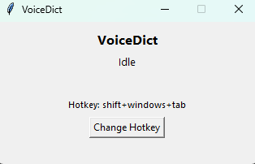

## VoiceDict

### This simple utility was generated in 1 chat with small modifications (gpt-5 Cursor) 

Simple app for typing text using your voice and the OpenAI API.
Type in your favorite IDE (e.g., Cursor).



### Download
- Windows x64: get the latest build from the Releases page: [Latest Release](../../releases/latest) · [All Releases](../../releases)
- Unzip and run `VoiceDict.exe`. On first launch, `.env` and `config.json` will be created next to the executable. Put your API key into `.env`:
```
OPENAI_API_KEY=sk-...
```

Chats with Cursor:
- [1_cursor_speech_recognition_program_for_w.md](./prompts/1_cursor_speech_recognition_program_for_w.md) - Generated stable version
- [2_cursor_exe.md](./prompts/2_cursor_exe.md) - Wrapped to `exe` file for Windows
- [3_cursor_.md](./prompts/3_cursor_.md) - Setup a release flow in GitHub

### Overview
- Voice typing into any Windows app window.
- Automatically detects input language.
- Global hotkey: Win+Shift+I — start/stop (can be changed in the UI).
- Transcribes multiple languages simultaneously, outputs in the focused input field.

### Quick start (from source)
- Set your `OPENAI_API_KEY` in a `.env` file (rename `.env.example` to `.env`).
- Run `run.bat` (creates venv and installs dependencies).

Hands‑free speech → text into any focused app (e.g., Cursor chat).

- Global hotkey: Win+Shift+I (toggle start/stop)
- Short sound effects on start/stop
- Transcribes English, Russian, and code reliably (OpenAI API)
- Types into the focused input of any opened app.
- Compact always‑on‑top UI shows status and last transcript.
- Emits short sound effects on start/stop.

### Requirements
- Windows 10+
- Python 3.10+
- An OpenAI API key
- Recommended: run the Python process as Administrator (for reliable global hotkeys)

### Install
```bash
# In repo root
python -m venv .venv
.\.venv\Scripts\activate
pip install -r requirements.txt

# Configure API key
copy .env.example .env
# Edit .env and set OPENAI_API_KEY
```

### Run
```bash
python voice_dict.py
```
### Notes
- Audio capture: 16 kHz mono, WebRTC VAD segments, up to ~15s per chunk
- Models: tries `gpt-4o-transcribe` first, falls back to `whisper-1`
- Typing: uses clipboard + Ctrl+V to preserve formatting and speed
- Beeps: Windows `winsound` (no external files needed)

### Troubleshooting
- API errors: verify `OPENAI_API_KEY` in `.env` and your account limits.
- Microphone busy: close other apps using the mic.

### Uninstall
- Deactivate and remove the virtual environment:
```bash
.\.venv\Scripts\deactivate
rmdir /s /q .venv
```